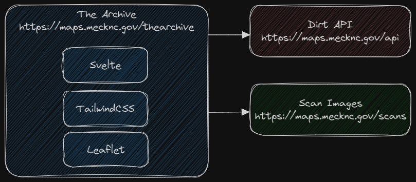

# The Archive

Mecklenburg County historic scans viewer, built with [Svelte](https://svelte.dev/), [TailwindCSS](https://tailwindcss.com/), and [Leaflet](https://leafletjs.com/). The development and build environment is [Vite](https://vitejs.dev/).

Site: [https://maps.mecknc.gov/thearchive](https://maps.mecknc.gov/thearchive)

## Architecture



The Archive is a single page application (SPA) and a progressive web app (PWA). Scan images are located on a web server folder. A database table accessed through the Dirt API is an index of the images used for searches and to return additional information. The Dirt API is also used to autocomplete addresses to return the tax book and page for the tax map scans.

Leaflet is being used as a non-spatial image viewer - the images are not spatial.

## Using the project

[Node.js](https://nodejs.org/en) is required to run the development and build systems, and [git](https://git-scm.com/) is required to use the versioning system.

**Clone the project**
```bash
git clone https://github.com/tobinbradley/thearchive.git
```

**Install dependencies**
```bash
cd thearchive
npm install
```

**Start the development server**
```bash
npm run dev
```

Navigate a web browser to [http://localhost:3000](http://localhost:3000) to view the HMR live development server.

**Build for production**
```bash
npm run build
```

After the build is complete, copy the contents of the `dist` folder to the production web server.